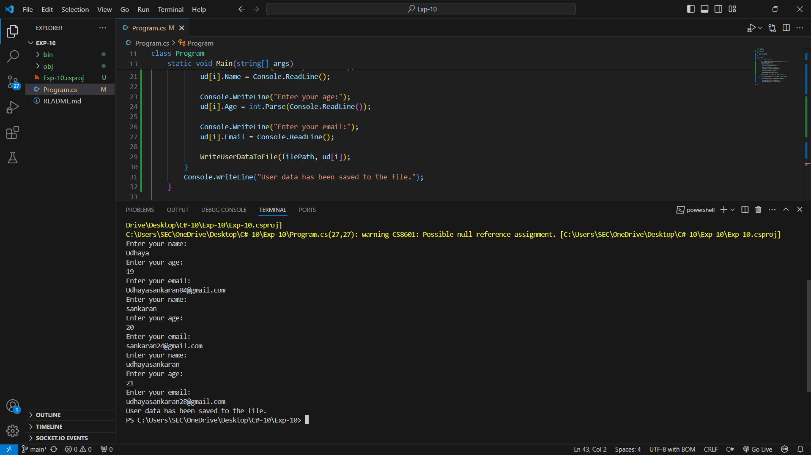
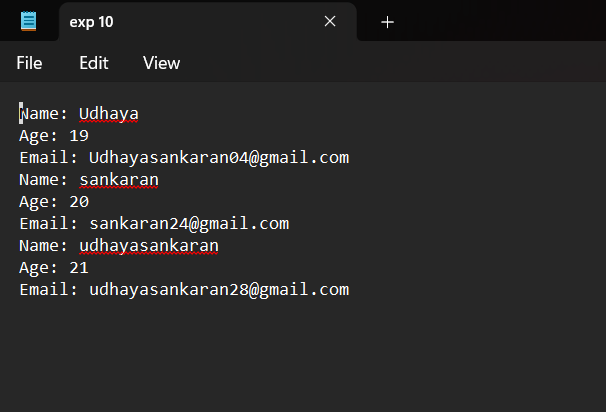

# 19AI308-Object-Oriented-Programming-using-CSharp-Exp-10-File-Manipulation
Develop a C# program to get the values from the user using structure and store it in a file in a specific path using file stream concept
# AIM:
To develop a C# program using file streams.

# PROGRAM:
```
using System;
using System.IO;

struct UserData
{
    public string Name;
    public int Age;
    public string Email;
}

class Program
{
    static void Main(string[] args)

    {
        string filePath = @"C:\Users\SEC\OneDrive\Desktop\exp 10.txt";
        UserData[] ud=new UserData[3];
        for(int i=0; i<3;i++)
        {
            Console.WriteLine("Enter your name:");
            ud[i].Name = Console.ReadLine();

            Console.WriteLine("Enter your age:");
            ud[i].Age = int.Parse(Console.ReadLine());

            Console.WriteLine("Enter your email:");
            ud[i].Email = Console.ReadLine();

            WriteUserDataToFile(filePath, ud[i]);
        }  
        Console.WriteLine("User data has been saved to the file.");
    }

    static void WriteUserDataToFile(string filePath, UserData userData)
    {
        using (StreamWriter writer = File.AppendText(filePath))
        { 
            writer.WriteLine($"Name: {userData.Name}");
            writer.WriteLine($"Age: {userData.Age}");
            writer.WriteLine($"Email: {userData.Email}");  
        }
    }
}
```
# OUTPUT:


# RESULT:
Thus the C# program to get the values from the user using structure and store it in a file in a specific path using file stream concept executed successfully.
